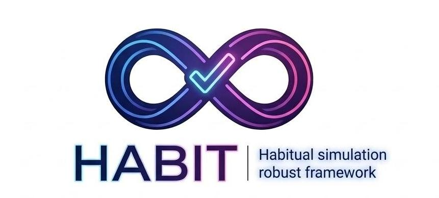
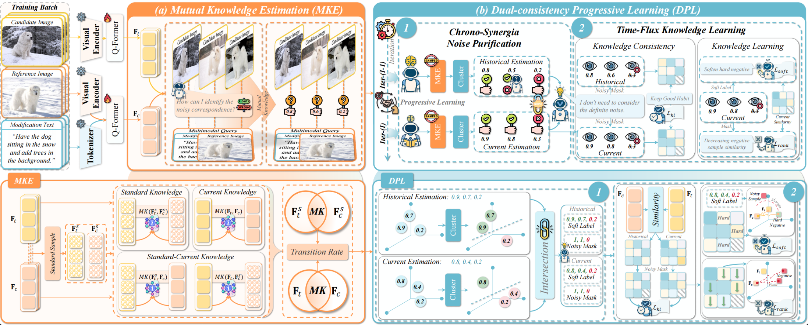
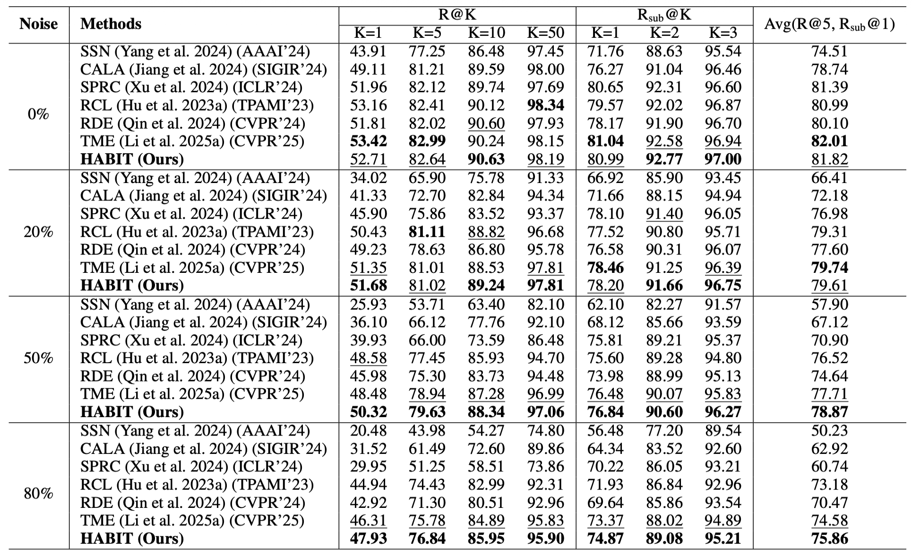
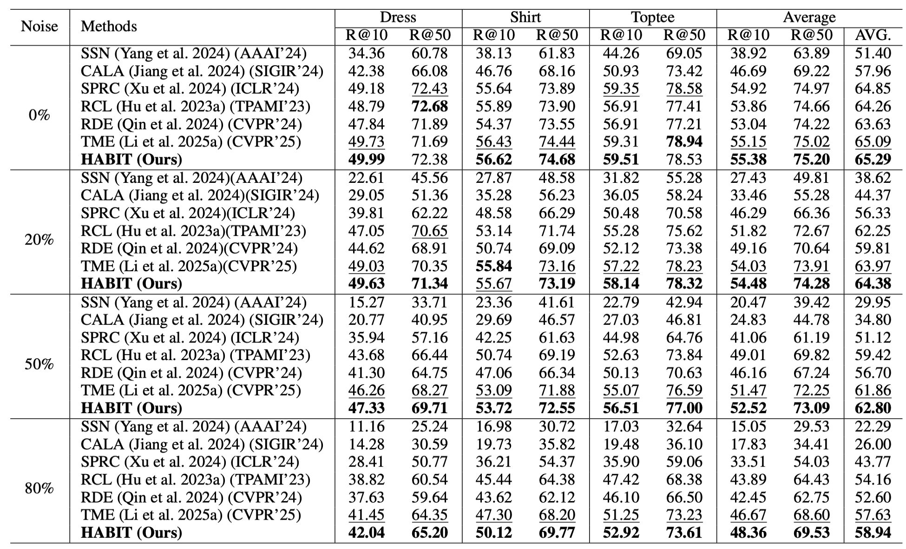

<div align="center">
  
  <h1>(AAAI 2026) HABIT: Chrono-Synergia Robust Progressive Learning Framework for Composed Image Retrieval</h1>
  
  <p>
      <a href="https://aaai.org/Conferences/AAAI-26/"></a>
      <a href="https://arxiv.org/abs/coming soon"></a>
      <a href="coming soon"></a>
    <a href=""></a>
    <a href="https://lee-zixu.github.io"></a>
    <a href="https://pytorch.org/get-started/locally/"></a>
    
    <a href="https://github.com/"></a>
    <!--  -->
  </p>

  <p>
    <b>Accepted by AAAI 2026:</b> A robust progressive learning framework tackling the Noise Triplet Correspondence (NTC) problem in Composed Image Retrieval (CIR).
  </p>
</div>

## 📌 Introduction

**HABIT** (cHrono-synergiA roBust progressIve learning framework for composed image reTrieval) is our proposed robust learning framework for Composed Image Retrieval, accepted by AAAI 2026. Based on an in-depth analysis of the "Noise Triplet Correspondence (NTC)" problem in real-world retrieval scenarios, HABIT effectively addresses the shortcomings of existing methods in precisely estimating composed semantic discrepancies and progressively adapting to modification discrepancies.

## 📢 News
- **[2026-03-18]** 🚀 Released all codes for HABIT.
- **[2025-11-08]** 🔥 Our paper *"HABIT: Chrono-Synergia Robust Progressive Learning Framework for Composed Image Retrieval"* has been accepted by **AAAI 2026**!


## ✨ Key Features

- 🧠 **Mutual Knowledge Estimation (MKE)**: Precisely quantifies sample cleanliness by computing the *Transition Rate* of mutual knowledge between composed features and target images, effectively identifying clean samples that align with modification semantics.
- ⏳ **Dual-consistency Progressive Learning (DPL)**: Introduces a collaborative mechanism between historical and current models to simulate human habit formation (retaining good habits and calibrating bad ones), enabling robust learning against noisy data interference.
- 🛡️ **Highly Robust to NTC**: Maintains State-of-the-Art (SOTA) retrieval performance under various Noise Triplet Correspondence (NTC) settings with different noise ratios ($0\%, 20\%, 50\%, 80\%$).

---

## 🏗️ Architecture

<p align="center">
  
</p>

## Table of Contents

- [News](#-news)
- [Key Features](#-key-features)
- [Install](#-install)
- [Data Preparation](#-data-preparation)
- [Quick Start](#-quick-start)
  - [Training under Noisy Settings](#1-training-under-noisy-settings)
  - [Testing](#2-testing)
- [Project Structure](#-project-structure)
- [Citation](#-citation)
- [Acknowledgement](#-acknowledgement)

---

## 📦 Install

**1. Clone the repository**

```bash
git clone https://github.com/Lee-zixu/HABIT
cd HABIT
```

**2. Setup Python Environment**

The code is evaluated on **Python 3.8.10** and **CUDA 12.6**. We recommend using Anaconda to create an isolated virtual environment:

```bash
conda create -n habit python=3.8
conda activate habit

# Install PyTorch (The evaluated environment uses Torch 2.1.0 with CUDA 12.1 compatibility)
pip install torch==2.1.0 torchvision==0.16.0 torchaudio==2.1.0 --index-url [https://download.pytorch.org/whl/cu121](https://download.pytorch.org/whl/cu121)

# Install core dependencies
pip install open-clip-torch==2.24.0 scikit-learn==1.3.2 transformers==4.25.0 salesforce-lavis==1.0.2 timm==0.9.16
```

> **Note**: Key dependencies include `salesforce-lavis` for the base architecture, `open-clip-torch` for vision-language features, and `scikit-learn` for DBSCAN clustering during Noise Discrimination.


-----

## 📂 Data Preparation

We evaluated our framework on two standard datasets: [FashionIQ](https://github.com/XiaoxiaoGuo/fashion-iq) and [CIRR](https://github.com/Cuberick-Orion/CIRR). Please download the datasets first.

<details>
<summary><b>Click to expand: FashionIQ Dataset Directory Structure</b></summary>

Please follow the official instructions to download the FashionIQ dataset. Once downloaded, ensure the folder structure looks like this:

```text
├── FashionIQ
│   ├── captions
│   │   ├── cap.dress.[train | val | test].json
│   │   ├── cap.toptee.[train | val | test].json
│   │   ├── cap.shirt.[train | val | test].json
│   ├── image_splits
│   │   ├── split.dress.[train | val | test].json
│   │   ├── split.toptee.[train | val | test].json
│   │   ├── split.shirt.[train | val | test].json
│   ├── dress
│   │   ├── [B000ALGQSY.jpg | B000AY2892.jpg | B000AYI3L4.jpg |...]
│   ├── shirt
│   │   ├── [B00006M009.jpg | B00006M00B.jpg | B00006M6IH.jpg | ...]
│   ├── toptee
│   │   ├── [B0000DZQD6.jpg | B000A33FTU.jpg | B000AS2OVA.jpg | ...]
```

</details>

<details>
<summary><b>Click to expand: CIRR Dataset Directory Structure</b></summary>

Please follow the official instructions to download the CIRR dataset. Once downloaded, ensure the folder structure looks like this:

```text
├── CIRR
│   ├── train
│   │   ├── [0 | 1 | 2 | ...]
│   │   │   ├── [train-10108-0-img0.png | train-10108-0-img1.png | ...]
│   ├── dev
│   │   ├── [dev-0-0-img0.png | dev-0-0-img1.png | ...]
│   ├── test1
│   │   ├── [test1-0-0-img0.png | test1-0-0-img1.png | ...]
│   ├── cirr
│   ├── captions
│   │   ├── cap.rc2.[train | val | test1].json
│   ├── image_splits
│   │   ├── split.rc2.[train | val | test1].json
```

</details>

-----

## 🚀 Quick Start

### 1\. Training under Noisy Settings

In our implementation, we introduce the `noise_ratio` parameter to simulate varying degrees of NTC (Noise Triplet Correspondence) interference. You can reproduce the experimental results from the paper by modifying the `--noise_ratio` parameter (default options evaluated are `0.0`, `0.2`, `0.5`, `0.8`).

**Training on FashionIQ:**

```bash
python train.py \
    --dataset fashioniq \
    --fashioniq_path "/path/to/FashionIQ/" \
    --model_dir "./checkpoints/fashioniq_noise0.2" \
    --noise_ratio 0.2 \
    --batch_size 256 \
    --num_epochs 20 \
    --lr 2e-5
```

**Training on CIRR:**

```bash
python train.py \
    --dataset cirr \
    --cirr_path "/path/to/CIRR/" \
    --model_dir "./checkpoints/cirr_noise0.5" \
    --noise_ratio 0.5 \
    --batch_size 256 \
    --num_epochs 20 \
    --lr 2e-5
```

> **💡 Tips:** > - Our model is based on the powerful BLIP-2 architecture. It is highly recommended to run the training on GPUs with sufficient memory (e.g., NVIDIA A40 48G / V100 32G).
>
>   - The best model weights and evaluation metrics generated during training will be automatically saved in the `best_model.pt` and `metrics_best.json` files within your specified `--model_dir`.

### 2\. Testing

To generate the prediction files on the CIRR dataset for submission to the [CIRR Evaluation Server](https://cirr.cecs.anu.edu.au/), run the following command:

```bash
python src/cirr_test_submission.py checkpoints/cirr_noise0.5/
```

*(The corresponding script will automatically output `.json` based on the generated best checkpoints in the folder for online evaluation.)*

-----

## 📁 Project Structure

Our code is deeply customized based on the LAVIS framework. The core implementations are centralized in the following files:

```text
HABIT/
├── lavis/
│   ├── models/
│   │   └── blip2_models/
│   │       └── HABIT.py      # 🧠 Core model implementation: Includes MKE, DPL modules, and loss functions
├── train.py                  # 🚀 Training entry point: Controls noise_ratio injection and training loops
├── datasets.py 
├── test.py 
├── utils.py 
├── data_utils.py 
├── cirr_test_submission.py   # Auxiliary scripts
├── datasets/                 # Dataset loading and processing logic
└── README.md
```

-----


## 🏃‍♂️ Experiment Results
### CIR Task Performance
#### CIRR：

#### FIQ:



-----

## 📝 Citation

If you find our work or this code useful in your research, please consider leaving a star or citing our paper 🥰:

```bibtex
@inproceedings{HABIT,
  title={HABIT: Chrono-Synergia Robust Progressive Learning Framework for Composed Image Retrieval},
  author={Li, Zixu and Hu, Yupeng and Chen, Zhiwei and Zhang, Shiqi and Huang, Qinlei and Fu, Zhiheng and Wei, Yinwei},
  booktitle={Proceedings of the AAAI Conference on Artificial Intelligence},
  year={2026}
}
```

## 🤝 Acknowledgement

The implementation of this project references the [LAVIS](https://github.com/salesforce/LAVIS) framework and the noise setting concepts from [TME](https://github.com/li-shuxian/TME). We express our sincere gratitude to these open-source contributions\!


## ✉️ Contact
For any questions, issues, or feedback, please open an issue on GitHub or reach out to me at lizixu.cs@gmail.com.
